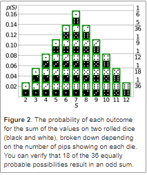

# Independent Alleles
## Problem
___

 Two events **A** and **B** are independent if **Pr(A and B)** is equal to **Pr(A) × Pr(B)**. In other words, the events do not influence each other, so that we may simply calculate each of the individual probabilities separately and then multiply.

More generally, random variables **X** and **Y** are independent if whenever **A** and **B** are respective events for **X** and **Y**, **A** and **B** are independent (i.e., **Pr(A and B)=Pr(A)×Pr(B)**).

As an example of how helpful independence can be for calculating probabilities, let *X* and *Y* represent the numbers showing on two six-sided dice. Intuitively, the number of pips showing on one die should not affect the number showing on the other die. If we want to find the probability that *X+Y* is odd, then we don't need to draw a tree diagram and consider all possibilities. We simply first note that for **X+Y** to be odd, either **X** is even and **Y** is odd or **X** is odd and **Y** is even. In terms of probability, **Pr(X+Y is odd)=Pr(X is even and Y is odd)+Pr(X is odd and Y is even)**. Using independence, this becomes [**Pr(X is even)×Pr(Y is odd)**]+[**Pr(X is odd)×Pr(Y is even)**], or ($\frac{1}{2}$)$^2$ + ($\frac{1}{2}$)$^2$ = $\frac{1}{2}$. You can verify this result in `Figure 2`, which shows all 36 outcomes for rolling two dice.

As an example of how helpful independence can be for calculating probabilities, let X and Y represent the numbers showing on two six-sided dice. Intuitively, the number of pips showing on one die should not affect the number showing on the other die. If we want to find the probability that X+Y is odd, then we don't need to draw a tree diagram and consider all possibilities. We simply first note that for X+Y to be odd, either X is even and Y is odd or X is odd and Y is even. In terms of probability, Pr(X+Y is odd)=Pr(X is even and Y is odd)+Pr(X is odd and Y is even). Using independence, this becomes [Pr(X is even)×Pr(Y is odd)]+[Pr(X is odd)×Pr(Y is even)], or (1/2)*2+(1/2)*2=1/2. You can verify this result in Figure 2, which shows all 36 outcomes for rolling two dice.

`Given:` Two positive integers k **(k≤7)** and N **(N≤2k)**. In this problem, we begin with Tom, who in the 0th generation has genotype Aa Bb. Tom has two children in the 1st generation, each of whom has two children, and so on. Each organism always mates with an organism having genotype Aa Bb.

`Return:` The probability that at least N Aa Bb organisms will belong to the k-th generation of Tom's family tree (don't count the Aa Bb mates at each level). Assume that Mendel's second law holds for the factors.

For more information, see ["Independent Alleles in Rosalind"](https://rosalind.info/problems/lia/)
